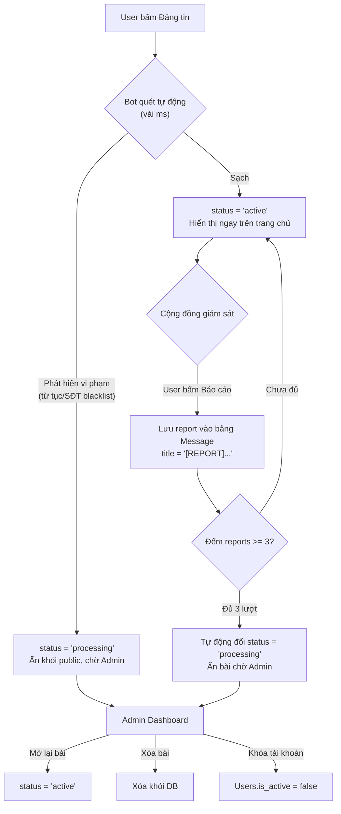

# Redesign Lost & Found + Hệ thống Hậu kiểm Hoàn chỉnh

## Mô tả tổng quan

**2 thay đổi lớn:**
1. **Giao diện**: Dark cyberpunk → Light professional (giống timdothatlac.vn)
2. **Nghiệp vụ**: Hệ thống hậu kiểm 4 tầng: Đăng ngay → Bot quét → Cộng đồng report → Admin xử lý

**Nguyên tắc**: Không sửa cấu trúc database. Tận dụng tối đa schema hiện có.

---

## Kiến trúc Hệ thống Hậu kiểm (Không sửa DB)



### Giải pháp kỹ thuật (Không sửa DB)

| Tính năng | Cách triển khai | Bảng DB sử dụng |
|---|---|---|
| Auto-publish | Đổi status mặc định `'processing'` → `'active'` trong code | `Items.status` |
| Bot quét từ tục | Java class `ContentFilter` + file `badwords.txt` | Không dùng DB |
| Bot quét blacklist SĐT | File `blacklist_phones.txt` + Admin CRUD qua file | Không dùng DB |
| Report bài viết | Lưu vào bảng `Message` với convention `title = '[REPORT] lý do'` | `Message` (có sẵn) |
| Đếm report | `COUNT(*) FROM Message WHERE title LIKE '[REPORT]%' AND related_item_id = ?` | `Message` (có sẵn) |
| Auto-hide khi đủ report | Đổi `Items.status = 'processing'` | `Items.status` (có sẵn) |
| Admin khóa tài khoản | Đổi `Users.is_active = false` | `Users.is_active` (có sẵn) |
| Bài bị ẩn public | Query thêm `WHERE status = 'active'` khi hiển thị | `Items.status` (có sẵn) |

> [!IMPORTANT]
> **Quy ước status mới (dùng cùng cột cũ)**:
> - `active` = Bài hiển thị công khai bình thường  
> - `processing` = Bài bị ẩn (bot chặn / report đủ số / chờ admin)
> - `completed` = Đã tìm thấy/trả đồ xong

---

## Proposed Changes

### PHẦN A: HỆ THỐNG HẬU KIỂM (Backend)

---

#### [NEW] ContentFilter.java — `src/java/util/ContentFilter.java`

Bộ lọc nội dung tự động, chạy khi user submit bài:

```java
public class ContentFilter {
    // Load từ file badwords.txt trong classpath
    private static Set<String> BAD_WORDS = loadBadWords();
    // Load từ file blacklist_phones.txt
    private static Set<String> BLACKLIST_PHONES = loadBlacklistPhones();
    
    // Quét title + description → trả về lý do vi phạm hoặc null nếu sạch
    public static String scan(String title, String description);
    
    // Quét SĐT trong nội dung
    public static boolean containsBlacklistedPhone(String text);
    
    // Admin thêm/xóa SĐT blacklist (ghi file)
    public static void addBlacklistPhone(String phone);
    public static void removeBlacklistPhone(String phone);
    public static List<String> getAllBlacklistPhones();
    
    // Reload cache
    public static void reloadBadWords();
    public static void reloadBlacklist();
}
```

#### [NEW] `badwords.txt` — `src/java/badwords.txt`

File text chứa danh sách từ cấm (mỗi dòng 1 từ), load vào HashSet khi server start.

#### [NEW] `blacklist_phones.txt` — `src/java/blacklist_phones.txt`  

File text chứa SĐT lừa đảo (mỗi dòng 1 số), Admin có thể CRUD qua giao diện.

---

#### [MODIFY] [ItemDAO.java](file:///d:/prj301/new_prj/SE2022_Nhom08_DeTai09/DUAN/ProjectPRJ301/src/java/dal/ItemDAO.java)

1. `insertItemByType()` → Đổi status mặc định: `'processing'` → `'active'`
2. Thêm `getActiveItemsByType()` — chỉ lấy bài `status = 'active'` cho trang public
3. Thêm `getItemsByStatus(String status)` — cho Admin lọc bài theo trạng thái
4. Thêm `getLatestActiveItems(int limit)` — lấy bài mới nhất (cả lost + found, status = active) cho trang chủ
5. Thêm `searchItems(String keyword, String type, Integer locationId)` — search text theo title

---

#### [MODIFY] [MessageDAO.java](file:///d:/prj301/new_prj/SE2022_Nhom08_DeTai09/DUAN/ProjectPRJ301/src/java/dal/MessageDAO.java)

Thêm methods cho tính năng Report:

```java
// Đếm số report của 1 bài viết
public int countReportsByItemId(int itemId);

// Kiểm tra user đã report bài này chưa (tránh spam)
public boolean hasUserReportedItem(int userId, int itemId);

// Lấy danh sách bài bị report (cho Admin dashboard)
public List<Map<String, Object>> getReportedItems();
```

Convention: Report được lưu là Message với `title LIKE '[REPORT]%'`

---

#### [MODIFY] [reportLostController.java](file:///d:/prj301/new_prj/SE2022_Nhom08_DeTai09/DUAN/ProjectPRJ301/src/java/controller/reportLostController.java)

Thêm logic bot quét sau khi insert:

```java
// Sau khi build item object, TRƯỚC khi insert:
String violation = ContentFilter.scan(title, description);
if (violation != null) {
    // Vẫn insert nhưng status = 'processing' thay vì 'active'
    // → bài bị ẩn, chuyển vào hàng chờ Admin
    item.setStatus("processing");
} else {
    item.setStatus("active"); // Hiển thị ngay
}
```

---

#### [NEW] ReportController.java — `src/java/controller/ReportController.java`

Servlet xử lý khi user bấm "Báo cáo":

```
POST /report_item
  - item_id: int
  - reason: String (Tin giả / Lừa đảo / Xúc phạm / Spam)

Logic:
1. Kiểm tra user đã report bài này chưa → từ chối nếu rồi
2. Insert Message: title="[REPORT] {reason}", message=reason, related_item_id=item_id
3. Đếm tổng report của bài → nếu >= 3: tự động đổi status = 'processing'
4. Redirect về trang trước + toast thông báo
```

---

#### [NEW] AdminModerationController.java — `src/java/controller/AdminModerationController.java`

Servlet cho Admin Dashboard hậu kiểm:

```
GET /admin_moderation → Hiển thị danh sách bài bị flag

POST /admin_moderation
  - action: "approve" | "hide" | "delete" | "ban_user"
  - item_id: int
  - user_id: int (cho ban)

Logic:
  approve → đổi status = 'active'  
  hide    → giữ status = 'processing'
  delete  → xóa bài
  ban_user → Users.is_active = false (khóa tài khoản vĩnh viễn)
```

---

#### [NEW] AdminBlacklistController.java — `src/java/controller/AdminBlacklistController.java`

CRUD quản lý blacklist SĐT lừa đảo (đọc/ghi file, không dùng DB):

```
GET /admin_blacklist → Hiển thị danh sách SĐT blacklist
POST /admin_blacklist
  - action: "add" | "remove"
  - phone: String
```

---

#### [MODIFY] [homeController.java](file:///d:/prj301/new_prj/SE2022_Nhom08_DeTai09/DUAN/ProjectPRJ301/src/java/controller/homeController.java)

- Public items chỉ hiển thị bài `status = 'active'`
- Truyền categories, locations cho sidebar
- Admin home: thêm thống kê bài bị report, bài chờ duyệt

---

#### [MODIFY] [listPublicItemsController.java](file:///d:/prj301/new_prj/SE2022_Nhom08_DeTai09/DUAN/ProjectPRJ301/src/java/controller/listPublicItemsController.java)

- Chỉ query bài `status = 'active'` (public không thấy bài bị ẩn)
- Thêm parameter `keyword` cho text search

---

#### [MODIFY] [AuthorizationFilter.java](file:///d:/prj301/new_prj/SE2022_Nhom08_DeTai09/DUAN/ProjectPRJ301/src/java/controller/AuthorizationFilter.java)

- Thêm `/report_item` vào danh sách cần login
- Thêm `/admin_moderation`, `/admin_blacklist` vào danh sách admin-only

---

#### [MODIFY] [web.xml](file:///d:/prj301/new_prj/SE2022_Nhom08_DeTai09/DUAN/ProjectPRJ301/web/WEB-INF/web.xml)

- Đăng ký 3 servlet mới: ReportController, AdminModerationController, AdminBlacklistController

---

### PHẦN B: GIAO DIỆN (Light Theme)

---

#### [MODIFY] [style.css](file:///d:/prj301/new_prj/SE2022_Nhom08_DeTai09/DUAN/ProjectPRJ301/web/assets/css/style.css)

Viết lại toàn bộ từ dark → light:

| Thành phần | Hiện tại | Mới |
|---|---|---|
| Body bg | `#0b0e1a` đen | `#f9fafb` xám nhạt |
| Card bg | gradient neon | `#ffffff` trắng |
| Text | trắng | `#1f2937` đen |
| Accent chính | Blue-violet gradient | **Cam `#fd7e14`** |
| Accent phụ | Neon cyan | **Xanh lá `#18773b`** |
| Navbar | Đen blur | **Trắng** border-bottom xám |
| Shadows | Glow neon | Box-shadow nhẹ |
| Emoji icons | Ở mọi nơi | **Bỏ hết**, dùng text/SVG |
| Gradient text | Mọi tiêu đề | **Không**, dùng color thường |

---

#### [MODIFY] [home.jsp](file:///d:/prj301/new_prj/SE2022_Nhom08_DeTai09/DUAN/ProjectPRJ301/web/WEB-INF/views/home.jsp)

- **Layout 2 cột**: Sidebar trái (menu danh mục) + Grid bài đăng phải
- Card bài đăng có **ảnh thumbnail**, tiêu đề, địa điểm, thời gian
- Bỏ greeting emoji, bỏ các nút action thừa
- Search bar ở navbar (giống timdothatlac)
- Bộ lọc location dropdown trên grid

---

#### [MODIFY] [items.jsp](file:///d:/prj301/new_prj/SE2022_Nhom08_DeTai09/DUAN/ProjectPRJ301/web/WEB-INF/views/items.jsp)

- Card có ảnh thumbnail thay vì text-only
- Sidebar lọc giữ nguyên logic, đổi style light
- Thêm ô search text

---

#### [MODIFY] [item_detail.jsp](file:///d:/prj301/new_prj/SE2022_Nhom08_DeTai09/DUAN/ProjectPRJ301/web/WEB-INF/views/item_detail.jsp)

- Light theme
- **Thêm nút "Báo cáo"** (cho user không phải chủ bài) → gọi `/report_item`
- Ảnh hiển thị lớn hơn, prominent hơn

---

#### [MODIFY] [report_lost.jsp](file:///d:/prj301/new_prj/SE2022_Nhom08_DeTai09/DUAN/ProjectPRJ301/web/WEB-INF/views/report_lost.jsp)

- Light theme giống form đăng tin timdothatlac
- Layout 2 cột: form trái, hướng dẫn phải

---

#### [MODIFY] Các trang còn lại

Tất cả các trang sau đổi sang light theme (chỉ CSS, giữ nguyên chức năng):
- [login.jsp](file:///d:/prj301/new_prj/SE2022_Nhom08_DeTai09/DUAN/ProjectPRJ301/web/WEB-INF/views/login.jsp)
- [register.jsp](file:///d:/prj301/new_prj/SE2022_Nhom08_DeTai09/DUAN/ProjectPRJ301/web/WEB-INF/views/register.jsp)
- [my_items.jsp](file:///d:/prj301/new_prj/SE2022_Nhom08_DeTai09/DUAN/ProjectPRJ301/web/WEB-INF/views/my_items.jsp)
- [inbox.jsp](file:///d:/prj301/new_prj/SE2022_Nhom08_DeTai09/DUAN/ProjectPRJ301/web/WEB-INF/views/inbox.jsp)
- [edit_item.jsp](file:///d:/prj301/new_prj/SE2022_Nhom08_DeTai09/DUAN/ProjectPRJ301/web/WEB-INF/views/edit_item.jsp)
- [edit_profile.jsp](file:///d:/prj301/new_prj/SE2022_Nhom08_DeTai09/DUAN/ProjectPRJ301/web/WEB-INF/views/edit_profile.jsp)

---

### PHẦN C: TRANG ADMIN MỚI

---

#### [NEW] admin_moderation.jsp — `web/WEB-INF/views/admin_moderation.jsp`

Dashboard hậu kiểm cho Admin:

**Gồm 2 section:**

1. **Bài bị Bot chặn** — Items có `status = 'processing'` mới tạo
   - Hiển thị: tiêu đề, lý do bị chặn, người đăng, ngày đăng
   - Actions: [Mở lại bài] [Xóa bài] [Khóa tài khoản]

2. **Bài bị Cộng đồng báo cáo** — Items có report >= 1 trong Message
   - Hiển thị: tiêu đề, số lượt report, lý do report mới nhất, người đăng
   - Actions: [Duyệt an toàn (mở lại)] [Xóa bài] [Khóa tài khoản]

---

#### [NEW] admin_blacklist.jsp — `web/WEB-INF/views/admin_blacklist.jsp`

Quản lý danh sách SĐT lừa đảo:

- Bảng hiển thị danh sách SĐT
- Form thêm SĐT mới
- Nút xóa từng SĐT
- Khi thêm SĐT → hệ thống tự động quét tất cả bài đăng hiện tại, nếu trùng → ẩn bài

---

#### [MODIFY] [home.jsp](file:///d:/prj301/new_prj/SE2022_Nhom08_DeTai09/DUAN/ProjectPRJ301/web/WEB-INF/views/home.jsp) (Admin section)

Thêm link tới Admin Moderation và Blacklist vào navbar/dashboard admin

---

### PHẦN D: TAGS & JS

---

#### [MODIFY] Các tag files

Đổi style light theme cho: `userMenu.tag`, `typeBadge.tag`, `statusBadge.tag`, `emptyState.tag`, `avatar.tag`, `roleBadge.tag`

---

#### [MODIFY] [app.js](file:///d:/prj301/new_prj/SE2022_Nhom08_DeTai09/DUAN/ProjectPRJ301/web/assets/js/app.js)

- Toast notification → light style
- Thêm confirm dialog cho nút "Báo cáo"
- Giữ nguyên logic hiện tại

---

## Tóm tắt Files

| Loại | Files | Ghi chú |
|---|---|---|
| **NEW** Java | `ContentFilter.java`, `ReportController.java`, `AdminModerationController.java`, `AdminBlacklistController.java` | 4 file mới |
| **NEW** Data | `badwords.txt`, `blacklist_phones.txt` | 2 file text |
| **NEW** JSP | `admin_moderation.jsp`, `admin_blacklist.jsp` | 2 trang admin mới |
| **MODIFY** Java | `ItemDAO.java`, `MessageDAO.java`, `reportLostController.java`, `homeController.java`, `listPublicItemsController.java`, `AuthorizationFilter.java` | 6 file sửa |
| **MODIFY** Config | `web.xml` | 1 file |
| **MODIFY** CSS | `style.css` | 1 file viết lại |
| **MODIFY** JS | `app.js` | 1 file |
| **MODIFY** JSP | 10 JSP views hiện có | Đổi light theme |
| **MODIFY** Tags | 6 tag files | Đổi light theme |
| **Tổng** | **~33 files** | |

---

## Verification Plan

### Functional Testing
1. **Đăng tin sạch** → Bài hiển thị ngay trên trang chủ (status = active)
2. **Đăng tin có từ tục** → Bài bị ẩn, xuất hiện trong Admin Moderation
3. **Đăng tin chứa SĐT blacklist** → Bài bị ẩn tự động
4. **User bấm Báo cáo** → Report được lưu, user không report được 2 lần
5. **Bài nhận 3 report** → Tự động ẩn, xuất hiện trong Admin dashboard
6. **Admin mở lại bài** → Bài hiện lại trên public
7. **Admin khóa tài khoản** → User không login được nữa
8. **Admin thêm SĐT vào blacklist** → Quét và ẩn bài liên quan

### Visual Testing
1. So sánh giao diện mới với timdothatlac.vn
2. Test responsive mobile
3. Kiểm tra tất cả trang hiển thị đúng light theme

### Regression Testing
1. Giữ nguyên chức năng: login, register, đăng tin, sửa tin, xóa tin, inbox, message, claim
2. Admin CRUD: users, categories, locations vẫn hoạt động bình thường
